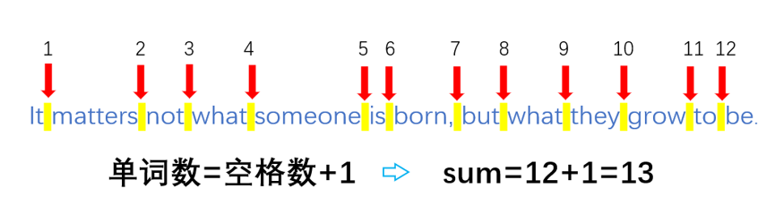

# 1061.统计单词数

[原题地址](http://www.51cpc.com/problem/1061)

[C++源码](main.cpp)
#### 题目描述
>输入一段英文句子，请统计句子中的单词数目

#### 输入格式
>输入一段英文句子（长度小于1000）包含空格

#### 输出格式
>输出单词数目

#### 样例
###### 输入：
>It matters not what someone is born, but what they grow to be.

###### 输出：
>13

### 分析

首先，我们会想到的是，将输入的字符串放到一个数组中，然后遍历每个元素，遇到空格时，对定义的统计单词数的变量进行自加。例如：“It matters not what someone is born, but what they grow to be.”这个字符串中，有12个空格，则单词的个数为:空格数+1 => 12+1=13。对于给出的样例，刚好符合输出结果。


但是,一个英文句子中的单词以任意个空格隔开时，这种👆方法<text style="color:red;font-size:24px">是不可行</text>的。

#### 换种思路：
 1. 当遍历到单词的第一个字母时，判为一个单词，计数变量加1
 2. 指针往后移，直到遇到下一个空格之后的非空元素，判为下一个单词
 3. 重复1和2的操作，知道字符串结束

 即：
 有字符串数组str[]，统计单词数的变量count
 ```C
 for(i = 0;i < 字符串长度；i++)
 {
     if(str[i]是字母)
     {
         count++;
         while(str[i]是字母&&str[i]不为‘\0’)
            i++;
     }
 }
 ```
