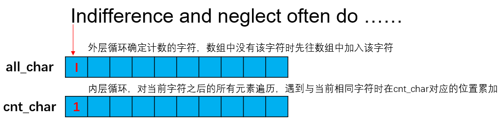
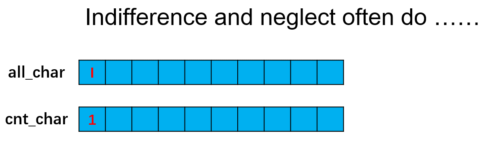

# 1062.最多字符

[原题地址](http://www.51cpc.com/problem/1062)

[C++ 源码](main.cpp)

#### 题目描述

>输入一段英文文本，请统计出当中除了空格之外出现次数最多的字符，本题输入为多组输入

#### 输入格式

>本题为多组输入。 每组测试案例输入长度小于1000的字符串并且可以包含空格

#### 输出格式

>对于每组测试案例，每行输出最多字符x和次数b，并且中间隔空格；（如果有多个字符的次数相同，只输出ASCII码最小的字符）

#### 样例

###### 输入：

>```md
>Indifference and neglect often do much more damage than outright dislike.
>It matters not what someone is born, but what they grow to be.
>```

###### 输出：

>```
>e 9
>t 9
>```

### 分析

题中多次讲到，本题为多组输入，所以我们需要注意输入的方式。另外，我们还要考虑字符串空格的接收。

我这里使用C++ ,首先需要定义一个接收每一组数据的字符串：

```C++
string input_content;  //每一组输入的内容
```

这个数组只用来接收一组数据，接收完这组立即处理，得到最多字符，再进行下一次接收。

对于字符串的接收，需要注意`std::cin`不能接收空格,所以这里换种方式，使用`getline()`函数接收。

```C++
while(getline(cin,input_content))
{
	...
}
```

#### 对字符串中的字符计数的思路

**思路一：双层循环**

最容易想到的，应该就是直接利用两层循环，第一次用来遍历数组，确定需要计数的字符，第二次循环用来对字符进行计数。






最后遍历`cnt_char`数组,得到最大数及其下标，输出`all_char`中对应下标的字符以及其出现次数。

这样做需要对已知字符串进行多次遍历。

**思路二：构建映射表**

即扫描已知字符串的同时，构建字符映射表（类似思路一的`all_char`中每个元素与`cnt_char`中映射），在扫描已知字符串时对构建的映射表进行扫描，查找当前字符是否在已构建的表中，如果有，则将对应的值进行累加。如果构建的映射表没有当前字符，则向映射表中添加此字符。

**思路三：构建ASCII码表**

直接用一维数组构建一个ASCCI码表，下标作字符的ASCII码值。遍历已知字符串，将字符强制转换为整型，再在数组内对应的位置进行累加。


最后找出`cnt`中的最大值，其对应的下标则为出现次数最多的字符的`ASCII`码，输出下标的`char`型以及其值即可。

+   计数的时候需要注意空格的计数以及出现次数相同的字符的处理。