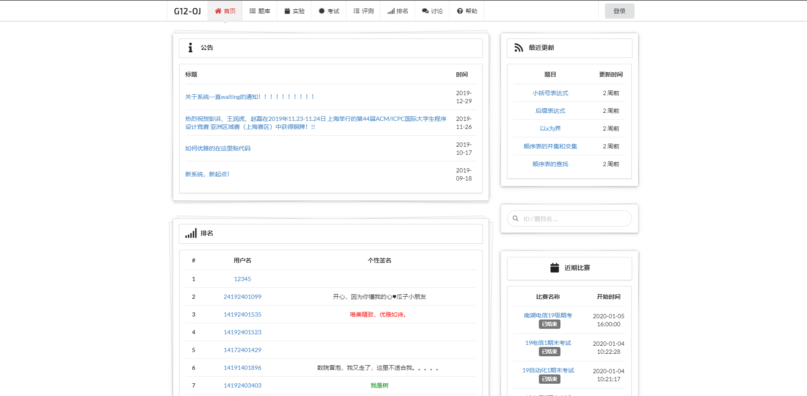
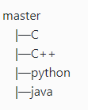
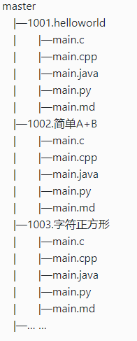

# hnist_oj 

这是一个online judge的题解项目，主要是针对我们学校——湖南理工学院的online judge上的题目的题解收集。欢迎各位相关专业有兴趣的同学积极参与。🙏

## 项目地址：
https://github.com/orphanBB/hnist_oj

## [湖南理工学院](http://www.hnist.cn) online judge
我们学校的oj网站为：www.51cpc.com
之前是可以自由注册账户的，但是后来老师关闭了注册接口，不知道还能不能注册，学校服务器不是很好，选课的时候人一多就崩，这个oj也是很容易死机，所以估计为了保证流畅，不会再开注册接口，全部由网站的负责人导入用户。

oj 首页
 

oj 题库
 

## 项目介绍

项目主要是为了方便湖南理工学院相关专业的学生在oj上刷题目时，能有个参照，主要目的是为了让部分学生参与到这个项目中，一方面了解git及github的操作，让大家在进入企业前，能提前了解并且熟悉一种版本控制工具。另一方面，希望通过参与这个项目，提高大家的算法分析能力，不仅能解题，更能从题目中看出考察的内容，以及提高对问题的详细分析能力，让自己不是迷迷糊糊的把题目刷了一遍，而是认认真真的把算法理解。

## 目录

[C++源码目录](https://github.com/orphanBB/hnist_oj/tree/cpp)

[C源码目录](https://github.com/orphanBB/hnist_oj/tree/c) 

[java源码目录](https://github.com/orphanBB/hnist_oj/tree/java )   

[python源码目录](https://github.com/orphanBB/hnist_oj/tree/python)

## 项目说明

### 结构
项目有一个master主分支，以及每个程序设计语言一个分支，现在已经有一个主分支以及四个语言分支了。
#### 分支结构：

#### 目录结构：
项目下，每个子目录对应oj上的一个题目，子目录名与题目名相同。子目录下存放源文件及解析文件，解析以markdown形式编写。
例如：

### push要求
* push前请确认文件结构及push的分支，不要推送到其他的语言分支。
* 合并时并不会对源文件运行检查，请尽量确保正确性。
* 不限开发环境，但请注意不要推送除源文件外的项目文件等与代码无关的文件推送。
*  解析文档的编写，可以参考leetcode题解项目: https://github.com/azl397985856/leetcode

## 感谢参与
orphanBB &emsp;&emsp;KADGang &emsp;&emsp;NCJ-BJS

## LICENSE
[MIT 许可证](LICENSE)
